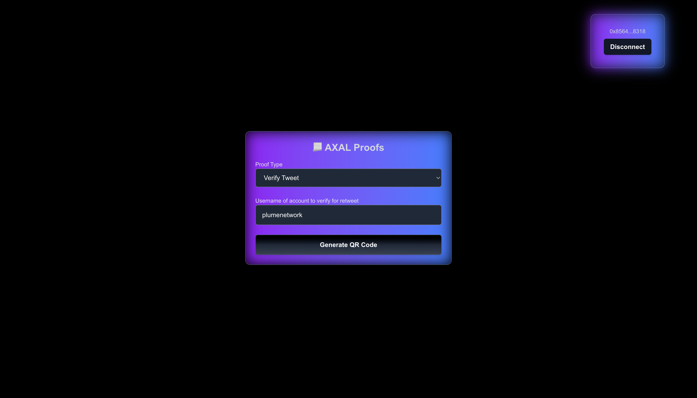

# Axal Proof Verification Portal 📃✅

Deployment link : https://axal-demo.vercel.app/ 

## 🔹 Overview
Axal Proof Verification Portal implements the twitter verification system that allows users to prove that they have retweeted tweets of a particular username. Such systems can be used for giving points or can be extended to verifying more specific tweets. Users receive rewards in ERC-20 tokens (AD20) if the proof is valid. I have used Reclaim Protocol with twitter provider.

## 🔹 How Reclaim Protocol is Used
1️⃣ User selects a proof type (e.g., verifying a Twitter retweet).  
2️⃣ Reclaim Protocol generates a cryptographic proof and provides a QR code.  
3️⃣ User scans the QR code and submits proof data.  
4️⃣ Currently the dapp verifies retweets from all the tweets returned by the reclaim-sdk, this logic can also be made on chain, had some ideas here  
5️⃣ Smart contract verifies the proof using Reclaim.verifyProof(). If valid, ERC-20 tokens (AD20) are transferred as a reward.  

**Note**: As much as I could explore, it looks like most of the tasks could be done using reclaim. Can extend it as required

## 🔹 Tech Stack

| Technology              | Usage                                                 |
|-------------------------|------------------------------------------------------|
| **Next.js (React)**     | Frontend framework                                    |
| **TailwindCSS**         | UI styling              |
| **Wagmi**   | Wallet connection & smart contract interactions      |
| **Reclaim Protocol SDK**| Fetch & verify data                     |
| **Hardhat**             | Smart contract deployment & testing                  |
| **Solidity**            | Smart contract logic for proof validation & rewards  |
| **Vercel**              | Deployment of frontend                               |
| **Sepolia Testnet**     | Blockchain network         |

## 🔹 Contracts 
**Axal Demo** : [0x5F7C99F3d6881e4E13e1DFed3292d9c9269C456e](https://sepolia.etherscan.io/address/0x5F7C99F3d6881e4E13e1DFed3292d9c9269C456e) 
This contract verifies proof and distributes rewards

**AD20** : [0x9c93423966df5f068696d210A945859f66987703](https://sepolia.etherscan.io/address/0x9c93423966df5f068696d210A945859f66987703)
This is the erc20 used to reward, each successful verification gives 10 AD20

## 🔹 Demo 
1. Put Username of the account you want to verify for retweet.

2. Generation of QR code

3. Scan QR code on the mobile reclaim app

4. Verify Proof

5. See AD20 added to your account. Either import the token or check the `balanceOf` your account on the explorer

**End Note :**
Given more time, I could have experimented more with the reclaim fetch, add a custom provider and enhance the contract logic for better onchain flow 

Thank you!
